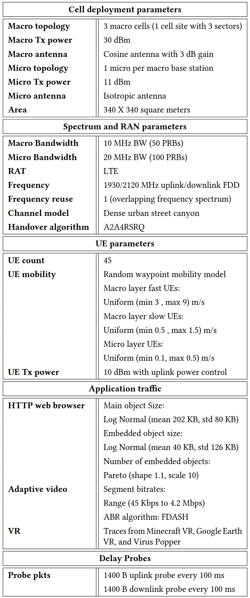

# mobile-network-datasets-ns3
This repository contains the following 
- A dataset creation framework based on the ns-3 simulator to create telecom network datasets in diverse scenarios. It comes packaged with the base ns-3 module along with additional third party ns-3 modules.
- A link to curated datasets created using this framework based on scenarios from the ETSI report, [A 5G Study on Scenarios and Requirements for Next Generation Access Technologies](https://www.etsi.org/deliver/etsi_tr/138900_138999/138913/14.02.00_60/tr_138913v140200p.pdf)   
- Data preprocessing code to parse the logs into datasets ready for machine learning training, code for performing sanity checks on them and visualization.
- Code for setting up the machine learning project as described in the paper [Self-supervised Pretraining for User Performance Prediction under Scarce Data Conditions](https://www.techrxiv.org/users/883047/articles/1261614-self-supervised-pretraining-for-user-performance-prediction-under-scarce-data-conditions)

# Install instructions for ns-3 Dataset Creation Framework
This is a full ns-3 installation along with the additional modules and changes to the base code. 

## Step 1: Clone the repository 
git clone https://github.com/akhila-s-rao/mobile-network-datasets-ns3.git

## Step 2: Go into the ns-3 code folder 
cd mobile-network-datasets-ns3/ns-3-dev 

## Step 3: Configure the ns-3 code
./waf configure --build-profile=optimized --enable-examples 

This creates an optimized build which disables debug mode and improves simulation speed.
To enable debug mode which allows you to print logs from the NS_LOG_COMPONENT 

./waf configure --enable-examples

Several components will not be configured and be shown in red. This is normal. 

## Step 4: Build the code
./waf build

## Step 5: Create a folder to store your logs
mkdir logs
 
## Step 6: Tune parameter knobs, modify the simulation scenario setup and run a simulation campaign   
cd mobile-network-datasets-ns3/ns-3-dev/src/nr/examples/dataset_gen_scripts 
edit run_script.sh as required
bash run_script.sh 

### Curated datasets generated from these scripts can be found at (google drive link)
https://drive.google.com/drive/folders/1-OQolvhK1mpFNFVLF4XTC_c3_EjLPwz-?usp=sharing

### Deployment illustration

[FDASH] Vergados DJ, Michalas A, Sgora A, Vergados DD, Chatzimisios P. FDASH: A fuzzy-based MPEG/DASH adaptation algorithm. IEEE Systems Journal. 2015 Dec 29;10(2):859-68
[Channel model] ETSI TR 138 901 V16.1.0 (2020-11) 5G Study on channel model for frequencies from 0.5 to 100 GHz
[VR] Lecci M, Zanella A, Zorzi M. An ns-3 implementation of a bursty traffic framework for virtual reality sources. InProceedings of the 2021 Workshop on ns-3 2021 Jun 23 (pp. 73-80)

### Table of observable metrics 

### Table of deployment and setup parameters

## Acknowledgement
This work was funded by the H2020 AI@EDGE project (grant. no. 101015922)

